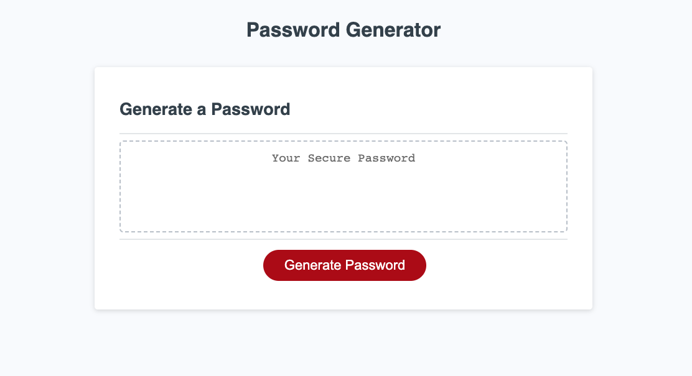
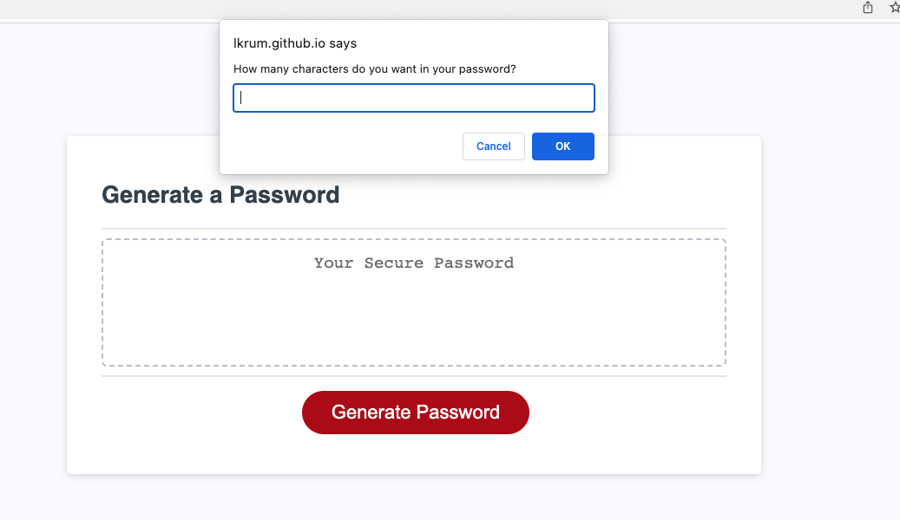
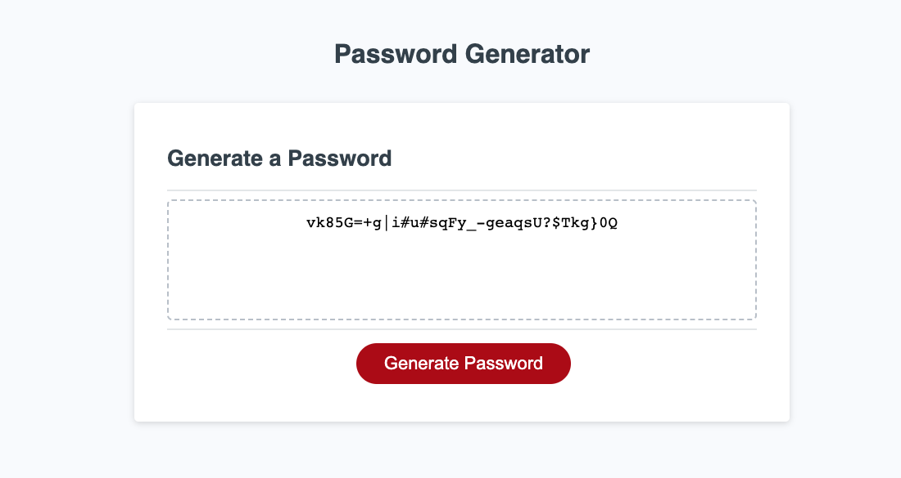

# Password Generator

## Description
Given the starter code, I created a JavaScript program to create a randomized password that meets specific sets of criteria. First, the password has to be between 8 and 128 characters in length. The user also has to select at least one character type from the following list: lowercase letters, uppercase letters, numbers, or symbols. Once the user selections are made, a randomized value appears in the box under "Generate a Password."

Link to live page: https://lkrum.github.io/Password-Generator/

## Installation
N/A

## Usage
Follow the page prompts to create a randomly generated password. 
1. Click the "Generate Password" button
2. Designate a password length in between 8 and 128 characters 
  - **Note**: If you select a length outside of the allowed range or input a value that isn't a number, you will get an alert to choose a different value.
3. Choose whether or not to include lowercase letters
4. Choose whether or not to include uppercase letters
5. Choose whether or not to include numbers
6. Choose whether or not to include special characters
- **Note**: If no criteria is chosen, you will get an alert to select at least one option.
- **Additional note**: You may need to refresh your page if generating multiple passwords.

## Credits 
My starter code was taken from the GitHub repository [friendly-parakeet](https://github.com/coding-boot-camp/friendly-parakeet.git). 

- alert function [w3schoools](https://developer.mozilla.org/en-US/docs/Web/API/Window/alert)
- prompt function [w3schoools](https://developer.mozilla.org/en-US/docs/Web/API/Window/prompt)
- confirm function [w3schoools](https://developer.mozilla.org/en-US/docs/Web/API/Window/confirm)
- math random function [w3schoools](https://developer.mozilla.org/en-US/docs/Web/JavaScript/Reference/Global_Objects/Math/random)
- array concatenation [w3schoools](https://www.w3schools.com/jsref/jsref_concat_array.asp)
- string split method [w3schoools](https://www.w3schools.com/jsref/jsref_split.asp)
- list of special characters [OWASP.org](https://owasp.org/www-community/password-special-characters)
- Once my random password was generated, I couldn't figure out how to combine it with the new user password array, so I looked up a reference for this part of the code[w3collective](https://w3collective.com/random-password-generator-javascript/): 
      userPassword +=
- Negin helped me format my window confirmation statements, helped me choose the right comparison operator, and format my arrays and strings correctly
- Patrick Lake, one of the bootcamp tutors, helped me finalize the math random function and helped me add returns
- Michael Bell helped me come up with the isNaN javascript method for validating whether my password input was not a number, so that I could prompt users to choose a valid input [w3schools](https://www.w3schools.com/jsref/jsref_isnan.asp)

## License
MIT License